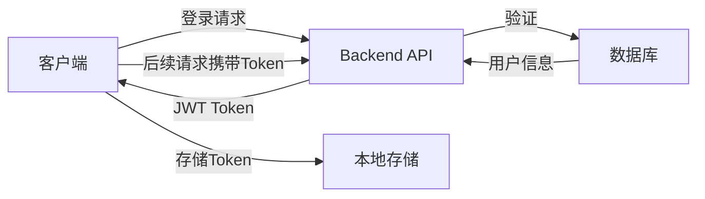

# 🏗️ LyricNote 项目架构

## 📦 Monorepo 结构

```
lyricnote/
├── packages/
│   ├── backend/          # Next.js 后端系统
│   ├── mobile/           # React Native 移动端
│   ├── miniapp/          # Taro 微信小程序
│   └── shared/           # 共享代码库
├── docs/                 # 项目文档
├── scripts/              # 构建脚本
└── pnpm-workspace.yaml   # pnpm workspace 配置
```

## 🎯 各包职责

### 1. Backend（后端系统）
**技术栈**: Next.js 15 + TypeScript + Drizzle ORM

**主要功能**:
- 🔐 用户认证（JWT）
- 👨‍💼 管理后台
- 📡 RESTful API
- 🗄️ 数据库管理
- ⚙️ 系统配置

**目录结构**:
```
packages/backend/
├── src/
│   ├── app/
│   │   ├── admin/              # 管理后台页面
│   │   ├── api/                # API 路由
│   │   │   ├── (backend)/      # 后台专用 API
│   │   │   ├── (common)/       # 通用 API
│   │   │   └── (mobile)/       # 移动端专用 API
│   │   └── page.tsx            # 首页
│   ├── components/             # React 组件
│   ├── lib/                    # 工具库
│   │   ├── auth/               # 认证模块
│   │   ├── config/             # 配置管理
│   │   └── drizzle/            # 数据库
│   └── services/               # 业务服务
├── drizzle/                    # 数据库 Schema
└── public/                     # 静态资源
```

**API 端点**:
- `/api/auth/*` - 认证相关（登录/注册/登出）
- `/api/admin/*` - 管理后台专用
- `/admin/*` - 管理后台页面

### 2. Mobile（React Native 移动端）
**技术栈**: React Native + Expo + TypeScript

**主要功能**:
- 📱 跨平台移动应用（iOS/Android）
- 🔐 用户认证
- 👤 个人中心

**目录结构**:
```
packages/mobile/
├── src/
│   ├── screens/              # 页面组件
│   │   ├── HomeScreen.tsx    # 首页
│   │   └── ProfileScreen.tsx # 我的页面
│   ├── components/           # UI 组件
│   │   └── ui/               # 通用 UI 组件
│   ├── navigation/           # 导航配置
│   ├── services/             # API 服务
│   │   └── api.ts            # API 封装
│   └── types/                # 类型定义
└── App.tsx                   # 应用入口
```

**页面**:
- 首页 - 欢迎页面
- 我的 - 用户登录和信息管理

### 3. Miniapp（微信小程序）
**技术栈**: Taro 3 + React + TypeScript + Sass

**主要功能**:
- 🎌 微信小程序
- 🔐 用户认证
- 👤 个人中心
- 🎵 听歌识曲（待开发）

**目录结构**:
```
packages/miniapp/
├── config/                   # Taro 配置
│   ├── index.ts              # 基础配置
│   ├── dev.ts                # 开发环境
│   └── prod.ts               # 生产环境
├── src/
│   ├── pages/                # 页面
│   │   ├── index/            # 首页
│   │   └── profile/          # 我的页面
│   ├── components/           # 组件
│   ├── services/             # API 服务
│   │   └── api.ts            # API 封装（Taro.request）
│   ├── utils/                # 工具函数
│   ├── types/                # 类型定义
│   ├── app.tsx               # 应用入口
│   └── app.config.ts         # 应用配置
├── project.config.json       # 小程序项目配置
└── tsconfig.json             # TypeScript 配置
```

**页面**:
- 首页 - 品牌展示
- 我的 - 用户登录和信息管理

### 4. Shared（共享库）
**技术栈**: TypeScript

**主要功能**:
- 🔄 类型定义共享
- 🛠️ 工具函数共享
- 📊 常量定义共享

**目录结构**:
```
packages/shared/
├── src/
│   ├── types/                # 通用类型定义
│   ├── utils/                # 工具函数
│   └── constants/            # 常量定义
└── dist/                     # 编译输出
```

## 🔄 数据流

### 认证流程



**实现方式**:
- Backend: JWT Token 生成和验证
- Mobile: AsyncStorage 存储 Token
- Miniapp: wx.storage 存储 Token

### API 调用流程

1. **客户端发起请求**
   ```typescript
   // Mobile/Miniapp
   const response = await apiService.login(email, password)
   ```

2. **请求到达 Backend**
   ```
   POST /api/auth/login
   ```

3. **Backend 处理**
   ```typescript
   // 验证用户
   const result = await DrizzleAuthService.signIn(email, password)
   // 返回用户信息和 Token
   return { success: true, data: result }
   ```

4. **客户端处理响应**
   ```typescript
   // 保存 Token 和用户信息
   await apiService.setToken(response.data.token)
   await apiService.saveUserData(response.data.user)
   ```

## 🔐 认证架构

### 统一认证接口

所有客户端（Web、Mobile、Miniapp）共享以下认证端点：

| 端点 | 方法 | 说明 |
|------|------|------|
| `/api/auth/register` | POST | 用户注册 |
| `/api/auth/login` | POST | 用户登录 |
| `/api/auth/me` | GET | 获取当前用户 |
| `/api/auth/logout` | POST | 用户登出 |

### Token 管理

**Backend**:
```typescript
// lib/auth/drizzle-auth.ts
class DrizzleAuthService {
  static signIn(email, password) { /* ... */ }
  static signUp(email, password, username) { /* ... */ }
  static getSession(token) { /* ... */ }
}
```

**Mobile (React Native)**:
```typescript
// services/api.ts
import AsyncStorage from '@react-native-async-storage/async-storage'
await AsyncStorage.setItem('auth_token', token)
```

**Miniapp (Taro)**:
```typescript
// services/api.ts
import Taro from '@tarojs/taro'
Taro.setStorageSync('auth_token', token)
```

## 📊 数据库架构

使用 **Drizzle ORM** + **PostgreSQL**:

```typescript
// drizzle/migrations/schema.ts
export const users = pgTable('users', {
  id: uuid('id').primaryKey().defaultRandom(),
  email: varchar('email', { length: 255 }).notNull().unique(),
  username: varchar('username', { length: 100 }).notNull(),
  password: varchar('password', { length: 255 }).notNull(),
  role: varchar('role', { length: 50 }).default('USER'),
  createdAt: timestamp('created_at').defaultNow(),
  updatedAt: timestamp('updated_at').defaultNow()
})
```

## 🚀 部署架构

### 开发环境

```
Backend:     localhost:3000
Mobile:      Expo 开发服务器
Miniapp:     微信开发者工具
Database:    本地 PostgreSQL
```

### 生产环境

```
Backend:     Vercel / 自建服务器
Database:    云数据库（PostgreSQL）
Mobile:      Expo/App Store/Google Play
Miniapp:     微信小程序平台
```

## 🛠️ 工具链

### 包管理
- **pnpm** - Monorepo 包管理
- **pnpm workspace** - 工作区管理

### 构建工具
- **Next.js** - Backend 构建
- **Expo** - Mobile 构建
- **Taro CLI** - Miniapp 构建
- **TypeScript** - 类型检查

### 开发工具
- **ESLint** - 代码检查
- **Drizzle Kit** - 数据库迁移
- **Expo CLI** - Mobile 开发
- **微信开发者工具** - 小程序开发

## 📝 命令速查

### 全局命令（项目根目录）
```bash
pnpm install              # 安装所有依赖
```

### Backend
```bash
cd packages/backend
pnpm dev                  # 启动开发服务器
pnpm db:dev:generate      # 生成数据库迁移
pnpm db:dev:push          # 应用数据库迁移
pnpm mobile:dev           # 启动移动端
pnpm miniapp:dev          # 启动小程序
```

### Mobile
```bash
cd packages/mobile
pnpm start                # 启动 Expo
pnpm ios                  # iOS 模拟器
pnpm android              # Android 模拟器
```

### Miniapp
```bash
cd packages/miniapp
pnpm dev                  # 启动开发（微信小程序）
pnpm build                # 构建小程序
```

## 🔗 相关文档

- [项目 README](./README.md)
- [Backend 文档](./packages/backend/README.md)
- [Mobile 文档](./packages/mobile/README.md)
- [Miniapp 指南](./MINIAPP_GUIDE.md)
- [快速命令](./QUICK_COMMANDS.md)
- [部署指南](./docs/deployment.md)

---

💡 **提示**: 这是一个 Monorepo 架构，所有包共享依赖和类型定义，确保代码复用和一致性。


