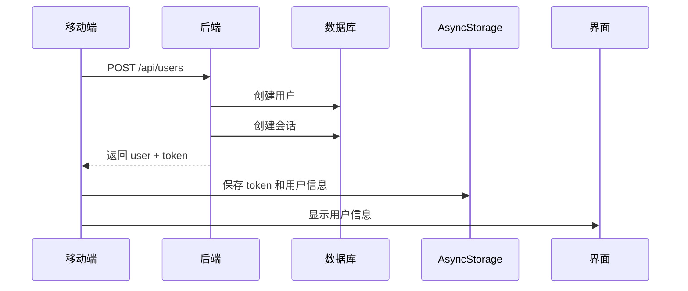
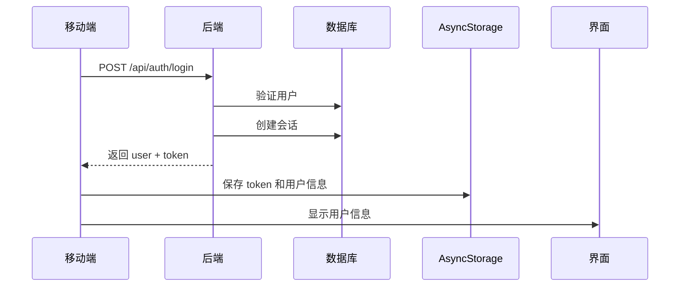
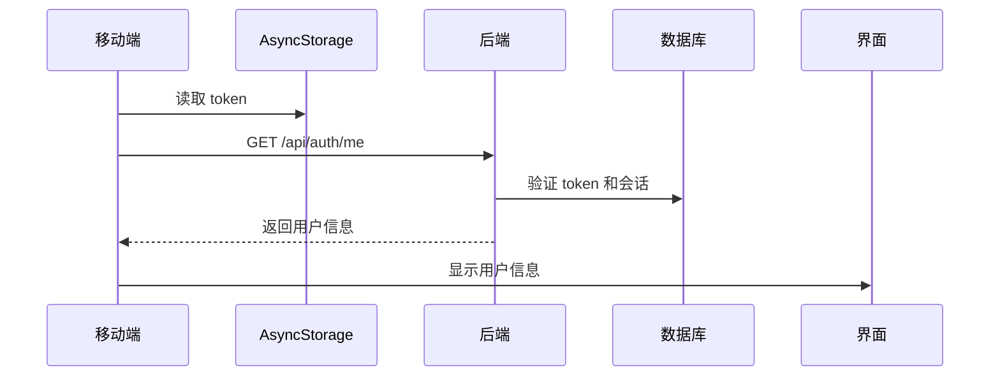

# 🔐 LyricNote 认证系统集成完成

## 📋 完成内容

已成功实现移动端与后台管理系统的统一认证，包括：

### ✅ 后端 API
1. **通用登录接口** - `/api/auth/login`
2. **通用登出接口** - `/api/auth/logout`
3. **获取用户信息** - `/api/auth/me`
4. **用户注册接口** - `/api/users`（已存在，已复用）

### ✅ 移动端
1. **API 服务** - 完整的认证 API 封装
2. **登录/注册界面** - 美观的表单界面
3. **用户中心** - 显示用户信息和退出登录
4. **自动登录** - 使用 AsyncStorage 保持登录状态

### ✅ 认证逻辑复用
- 管理后台和移动端共用 `DrizzleAuthService`
- 统一的 JWT token 认证
- 相同的会话管理机制

## 📁 新增文件

### 后端
```
packages/backend/src/app/api/(common)/auth/
├── login/
│   └── route.ts          # 登录接口
├── logout/
│   └── route.ts          # 登出接口
└── me/
    └── route.ts          # 获取当前用户信息
```

### 移动端
```
packages/mobile/
├── src/services/
│   └── api.ts            # API 服务（重写）
├── src/screens/
│   └── ProfileScreen.tsx # 我的页面（重写，包含登录注册）
├── AUTH_SETUP.md         # 认证设置指南
└── package.json          # 新增 AsyncStorage 依赖
```

## 🚀 快速开始

### 1. 安装依赖

```bash
# 根目录安装所有依赖
pnpm install

# 或单独安装移动端依赖
cd packages/mobile
pnpm install
```

### 2. 配置 API 地址

编辑 `packages/mobile/.env`：

```bash
# 本地开发（iOS 模拟器）
EXPO_PUBLIC_API_URL=http://localhost:3000/api

# 本地开发（Android 模拟器）
EXPO_PUBLIC_API_URL=http://10.0.2.2:3000/api

# 真机测试（替换为你的电脑 IP）
EXPO_PUBLIC_API_URL=http://192.168.1.100:3000/api
```

### 3. 启动服务

**启动后端：**
```bash
cd packages/backend
pnpm dev
```

**启动移动端：**
```bash
cd packages/mobile
pnpm start
```

## 🔄 工作流程

### 用户注册流程


### 用户登录流程


### 自动登录流程


## 📱 界面展示

### 未登录状态
- **登录 Tab** - 邮箱 + 密码
- **注册 Tab** - 用户名 + 邮箱 + 密码
- 一键切换登录/注册模式

### 已登录状态
- 用户头像（首字母大写）
- 用户名和邮箱
- 用户角色标签
- 退出登录按钮

## 🔐 安全特性

1. **密码加密**
   - 使用 bcryptjs 加密存储
   - 加密强度：12 rounds

2. **JWT Token**
   - 有效期：7 天
   - 包含用户 ID、邮箱、角色

3. **会话管理**
   - 数据库存储会话
   - 过期时间验证
   - 支持单点登出

4. **权限控制**
   - 管理后台：需要 ADMIN 或 SUPER_ADMIN 角色
   - 移动端：所有角色都可登录

## 🧪 测试账户

### 创建测试账户

**方式一：通过移动端注册**
1. 打开移动端应用
2. 点击"我的" tab
3. 选择"注册"
4. 输入信息并提交

**方式二：使用后台创建的管理员账户**
```
邮箱: admin@lyricnote.local
密码: admin123
角色: SUPER_ADMIN
```

## 🔧 API 接口

### 1. 用户注册
```http
POST /api/users
Content-Type: application/json

{
  "email": "user@example.com",
  "username": "username",
  "password": "password123"
}
```

### 2. 用户登录
```http
POST /api/auth/login
Content-Type: application/json

{
  "email": "user@example.com",
  "password": "password123"
}
```

### 3. 获取当前用户
```http
GET /api/auth/me
Authorization: Bearer <token>
```

### 4. 登出
```http
POST /api/auth/logout
Authorization: Bearer <token>
```

## 📊 数据流

### Token 存储位置
- **管理后台 (Web)**：`localStorage`
  - Key: `auth-token`
  - Key: `auth-user`

- **移动端 (App)**：`AsyncStorage`
  - Key: `auth_token`
  - Key: `user_data`

### 认证流程
1. 用户登录/注册
2. 后端生成 JWT token
3. 后端创建会话记录
4. 前端存储 token 和用户信息
5. 后续请求携带 token
6. 后端验证 token 和会话

## 🐛 故障排除

### 问题 1: 无法连接后端

**症状**：移动端提示网络错误

**解决方案**：
```bash
# 检查后端是否运行
curl http://localhost:3000/api/health

# 检查 API 地址配置
# iOS: http://localhost:3000/api
# Android: http://10.0.2.2:3000/api
# 真机: http://YOUR_IP:3000/api
```

### 问题 2: Token 无效

**症状**：登录后立即要求重新登录

**解决方案**：
- 检查后端 JWT_SECRET 配置
- 清除应用数据重新登录
- 查看后端日志

### 问题 3: AsyncStorage 错误

**症状**：找不到 AsyncStorage 模块

**解决方案**：
```bash
cd packages/mobile
npx expo install @react-native-async-storage/async-storage
```

## 📚 相关文档

- [移动端认证设置指南](packages/mobile/AUTH_SETUP.md)
- [管理后台登录指南](admin-access-guide.md)
- [后端 API 文档](packages/backend/README.md)

## 🎯 下一步

可以继续添加的功能：
- [ ] 忘记密码
- [ ] 邮箱验证
- [ ] 第三方登录（Google, Apple）
- [ ] 用户资料编辑
- [ ] 头像上传
- [ ] 修改密码

---

## ✨ 特性亮点

### 1. 统一认证
- ✅ 管理后台和移动端使用相同的认证逻辑
- ✅ 代码复用，维护简单

### 2. 安全可靠
- ✅ JWT token 认证
- ✅ 密码加密存储
- ✅ 会话管理

### 3. 用户体验
- ✅ 自动保持登录
- ✅ 优雅的 UI 设计
- ✅ 流畅的交互

### 4. 易于扩展
- ✅ 清晰的代码结构
- ✅ 完善的类型定义
- ✅ 详细的文档说明

🎉 **认证系统集成完成！**

