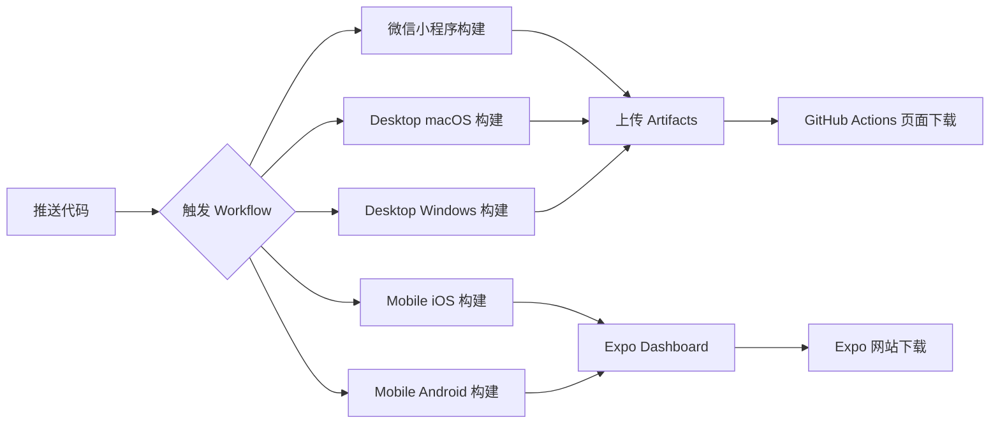

# 🎉 前端构建系统已配置完成!

## ✅ 已完成的工作

### 1. GitHub Actions Workflow
创建了 `.github/workflows/build-frontend.yml`,支持:

#### 📱 微信小程序
- ✅ 自动构建小程序代码
- ✅ 打包为 `.zip` 格式
- ✅ 上传到 GitHub Artifacts
- ⏱️ 构建时间: ~3 分钟

#### 🖥️ Desktop 桌面端
- ✅ macOS (.dmg) - 在 macOS 运行器上构建
- ✅ Windows (.exe) - 在 Windows 运行器上构建
- ✅ 支持 Electron Builder
- ⏱️ 构建时间: ~8 分钟/平台

#### 📱 Mobile 移动端
- ✅ iOS (.ipa) - 通过 EAS Build
- ✅ Android (.apk/.aab) - 通过 EAS Build
- ⚠️ 需要配置 `EXPO_TOKEN` secret
- ⏱️ 构建时间: ~15 分钟

### 2. 完整文档

#### 📖 [FRONTEND_BUILD_GUIDE.md](docs/FRONTEND_BUILD_GUIDE.md)
- 详细的构建配置说明
- 每个平台的具体步骤
- GitHub Secrets 配置指南
- 代码签名配置 (可选)
- 发布到应用商店的流程
- 常见问题排查

#### 🚀 [BUILD_ARTIFACTS_QUICK_START.md](docs/BUILD_ARTIFACTS_QUICK_START.md)
- 快速开始指南
- 如何触发构建
- 如何下载产物
- 产物使用方式
- 常见问题 FAQ

---

## 🚀 如何使用

### 方式一: 手动触发 (推荐)

1. 推送代码到 GitHub:
   ```bash
   git push origin main
   ```

2. 访问 GitHub Actions:
   https://github.com/qxdqhr/LyricNote/actions/workflows/build-frontend.yml

3. 点击 **"Run workflow"**

4. 选择要构建的平台:
   - `all` - 所有平台 (默认)
   - `desktop` - 桌面端 (macOS + Windows)
   - `mobile` - 移动端 (iOS + Android)
   - `miniapp` - 微信小程序

5. 等待构建完成 (~20-30 分钟)

6. 在运行页面底部的 **Artifacts** 区域下载

### 方式二: 代码推送自动触发

```bash
# 推送到 main 或 develop 分支
git push origin main

# 或创建版本 tag
git tag v1.0.0
git push origin v1.0.0
```

---

## 📦 产物列表

| 平台 | 产物名称 | 格式 | 大小 | 下载位置 |
|------|---------|------|------|---------|
| 微信小程序 | `miniapp-wechat-{sha}` | .zip | ~2MB | GitHub Artifacts |
| macOS | `desktop-macos-{sha}` | .dmg | ~100MB | GitHub Artifacts |
| Windows | `desktop-windows-{sha}` | .exe | ~80MB | GitHub Artifacts |
| iOS | iOS Build | .ipa | ~50MB | Expo Dashboard |
| Android | Android Build | .apk | ~30MB | Expo Dashboard |

---

## ⚙️ 首次使用配置

### 必需配置

#### 无需配置 ✅
- 微信小程序
- Desktop macOS
- Desktop Windows

这些平台可以直接构建!

### 可选配置

#### 移动端 (iOS/Android) - 需要 EXPO_TOKEN

1. **创建 Expo 账号**
   - 访问: https://expo.dev/signup
   - 注册并登录

2. **获取 Access Token**
   - 访问: https://expo.dev/accounts/[username]/settings/access-tokens
   - 点击 "Create Token"
   - 复制 token

3. **配置 GitHub Secret**
   - 访问: https://github.com/qxdqhr/LyricNote/settings/secrets/actions
   - 点击 "New repository secret"
   - 名称: `EXPO_TOKEN`
   - 值: 粘贴你的 token

4. **完成!** 下次构建会自动包含移动端

#### 代码签名 (可选,用于发布)

**macOS 签名**:
```
APPLE_ID: 你的 Apple ID
APPLE_ID_PASSWORD: 应用专用密码
APPLE_TEAM_ID: 团队 ID
```

**Windows 签名**:
```
WIN_CSC_LINK: Base64 证书
WIN_CSC_KEY_PASSWORD: 证书密码
```

---

## 📊 构建流程



---

## 🎯 下一步

### 立即可用
1. ✅ 推送代码到 GitHub
2. ✅ 触发构建
3. ✅ 下载小程序和桌面端安装包

### 配置移动端 (5分钟)
1. 创建 Expo 账号
2. 获取 Access Token
3. 配置到 GitHub Secrets
4. 重新触发构建

### 发布到应用商店
1. 阅读 [FRONTEND_BUILD_GUIDE.md](docs/FRONTEND_BUILD_GUIDE.md) 中的"发布流程"章节
2. 配置代码签名 (如需要)
3. 按各平台要求准备应用信息
4. 提交审核

---

## 📝 待推送的更改

当前本地有以下提交未推送到 GitHub:

```bash
git log origin/main..HEAD --oneline
```

请执行推送:
```bash
cd /Users/qihongrui/Desktop/LyricNote
git push origin main
```

推送后,GitHub Actions 会自动检测到新的 workflow 文件。

---

## 🔍 验证安装

推送后,访问以下链接验证:

1. **Workflow 文件**: 
   https://github.com/qxdqhr/LyricNote/blob/main/.github/workflows/build-frontend.yml

2. **Actions 页面**: 
   https://github.com/qxdqhr/LyricNote/actions

3. **手动触发**: 
   https://github.com/qxdqhr/LyricNote/actions/workflows/build-frontend.yml

---

## 📚 相关文档

- [详细构建指南](docs/FRONTEND_BUILD_GUIDE.md) - 完整配置和使用说明
- [快速开始](docs/BUILD_ARTIFACTS_QUICK_START.md) - 快速获取构建产物
- [Tailwind v4 迁移](docs/TAILWIND_V4_MIGRATION.md) - Tailwind CSS v4 升级说明

---

## 🆘 需要帮助?

### 查看日志
1. 访问 GitHub Actions 页面
2. 点击失败的运行
3. 查看具体 job 的日志

### 常见问题

**Q: 构建失败了怎么办?**
A: 查看 [FRONTEND_BUILD_GUIDE.md](docs/FRONTEND_BUILD_GUIDE.md) 中的"构建失败排查"章节

**Q: 移动端没有产物?**
A: 需要配置 `EXPO_TOKEN`,或在 [Expo Dashboard](https://expo.dev) 查看

**Q: 产物在哪里下载?**
A: Actions 运行页面底部的 Artifacts 区域

---

## ✨ 特性亮点

- 🚀 **并行构建** - 所有平台同时构建,节省时间
- 🎯 **选择性构建** - 可以只构建需要的平台
- 📦 **自动打包** - 代码推送自动触发构建
- 💾 **长期保留** - Artifacts 保留 30 天
- 🔄 **版本管理** - Tag 推送自动构建发布版本
- 📊 **构建报告** - 详细的构建状态和日志

---

## 🎉 完成!

你的 LyricNote 项目现在拥有完整的前端构建流水线!

**推送代码后即可开始使用:**
```bash
git push origin main
```

**祝构建顺利! 🚀**

