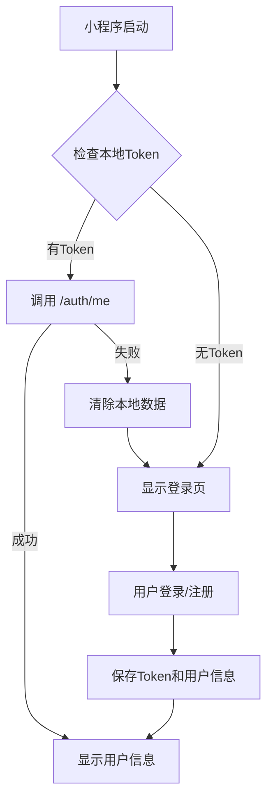

# 🎌 LyricNote 微信小程序开发指南

## 📋 简介

LyricNote 微信小程序基于 **Taro 3** 框架开发，支持多端编译，与后端系统共享认证逻辑。

## 🚀 快速开始

### 1. 安装依赖

```bash
cd packages/miniapp
pnpm install
```

### 2. 配置 API 地址

创建环境配置文件（可选）：

```bash
# packages/miniapp/.env
TARO_APP_API_URL=http://localhost:3000/api
```

或在代码中直接配置（`src/services/api.ts`）：

```typescript
const API_BASE_URL = 'http://192.168.1.100:3000/api'  // 替换为你的电脑IP
```

### 3. 启动开发

```bash
# 在小程序目录
pnpm dev

# 或从 backend 目录启动
cd packages/backend
pnpm miniapp:dev
```

### 4. 打开微信开发者工具

1. 下载并安装[微信开发者工具](https://developers.weixin.qq.com/miniprogram/dev/devtools/download.html)
2. 打开开发者工具，选择"导入项目"
3. 项目目录：`packages/miniapp/dist`
4. AppID：选择"测试号"或输入自己的 AppID

## 📱 开发流程

### 启动后台服务

```bash
# 终端 1：启动后台 API 服务
cd packages/backend
pnpm dev
```

### 启动小程序开发

```bash
# 终端 2：启动小程序编译
cd packages/miniapp
pnpm dev
```

### 真机调试

1. **配置 API 地址**
   - 查看电脑 IP：`ifconfig`（Mac/Linux）或 `ipconfig`（Windows）
   - 修改 `src/services/api.ts` 中的 API_BASE_URL 为电脑 IP
   
   ```typescript
   const API_BASE_URL = 'http://192.168.1.100:3000/api'
   ```

2. **微信开发者工具设置**
   - 打开"详情" → "本地设置"
   - 勾选"不校验合法域名、web-view（业务域名）、TLS 版本以及 HTTPS 证书"

3. **预览**
   - 点击工具栏"预览"按钮
   - 扫描二维码在手机上打开

## 🎨 功能说明

### 当前功能

- ✅ 用户登录
- ✅ 用户注册
- ✅ 查看用户信息
- ✅ 退出登录
- ✅ 自动保持登录状态

### 页面结构

```
首页 (pages/index)
├── 欢迎页面
└── 品牌展示

我的 (pages/profile)
├── 未登录状态
│   ├── 登录表单
│   └── 注册表单
└── 已登录状态
    ├── 用户信息展示
    └── 退出登录按钮
```

## 🔧 配置说明

### project.config.json

小程序项目配置：

```json
{
  "miniprogramRoot": "dist/",
  "projectname": "lyricnote-miniapp",
  "appid": "你的AppID",
  "setting": {
    "urlCheck": true,    // 生产环境改为 true
    "es6": false,
    "enhance": true
  }
}
```

### app.config.ts

应用配置：

```typescript
export default defineAppConfig({
  pages: [
    'pages/index/index',
    'pages/profile/index'
  ],
  window: {
    navigationBarBackgroundColor: '#8b5cf6',
    navigationBarTitleText: 'LyricNote',
    navigationBarTextStyle: 'white'
  },
  tabBar: {
    // Tab Bar 配置
  }
})
```

## 🔐 认证集成

### API 服务封装

```typescript
import { apiService } from '@/services/api'

// 登录
const response = await apiService.login(email, password)

// 注册
const response = await apiService.register(email, password, username)

// 获取当前用户
const response = await apiService.getCurrentUser()

// 登出
await apiService.logout()

// 检查登录状态
const isAuth = await apiService.isAuthenticated()
```

### 存储机制

- **Token**: 存储在 `wx.storage`，key 为 `auth_token`
- **用户信息**: 存储在 `wx.storage`，key 为 `user_data`
- 自动在每次请求中携带 token

### 认证流程



## 📝 开发命令

### 小程序相关

```bash
# 开发模式（微信小程序）
pnpm dev
pnpm dev:weapp

# 其他平台
pnpm dev:alipay   # 支付宝小程序
pnpm dev:swan     # 百度小程序
pnpm dev:tt       # 字节跳动小程序
pnpm dev:h5       # H5

# 构建
pnpm build
pnpm build:weapp
```

### 从 backend 启动

```bash
cd packages/backend
pnpm miniapp:dev    # 启动小程序开发
pnpm mobile:dev     # 启动 RN 移动端
```

## 🎯 Tab Bar 图标

Tab Bar 需要图标文件，放置在 `src/assets/` 目录：

- `tab-home.png` - 首页图标（未选中）
- `tab-home-active.png` - 首页图标（选中）
- `tab-profile.png` - 我的图标（未选中）
- `tab-profile-active.png` - 我的图标（选中）

**图标要求**：
- 尺寸：81px × 81px
- 格式：PNG
- 未选中：灰色 (#9ca3af)
- 选中：紫色 (#8b5cf6)

## 🐛 常见问题

### Q: 网络请求失败？

**A:** 检查以下几点：

1. 后端服务是否已启动（`http://localhost:3000`）
2. API 地址是否配置正确
3. 开发者工具中是否勾选"不校验合法域名"
4. 真机调试时使用电脑 IP 而非 localhost

### Q: 如何查看网络请求？

**A:** 
1. 打开微信开发者工具
2. 切换到"Network"面板
3. 查看请求详情和响应

### Q: 样式显示异常？

**A:**
1. 确保使用 `rpx` 作为单位（而非 px）
2. 检查样式文件是否正确引入
3. 查看是否有样式冲突

### Q: 如何调试？

**A:**
1. 使用 `console.log()` 输出日志
2. 微信开发者工具的 Console 面板查看
3. 使用 `Taro.showToast()` 显示提示信息
4. 使用断点调试（Sources 面板）

### Q: 真机扫码后白屏？

**A:**
1. 检查 API 地址是否使用电脑 IP
2. 确保手机和电脑在同一网络
3. 检查防火墙是否阻止了端口 3000
4. 查看 Console 是否有错误信息

## 📚 技术栈

- **框架**: Taro 3.6
- **UI**: Taro Components
- **语言**: TypeScript
- **样式**: Sass
- **状态管理**: React Hooks
- **网络请求**: Taro.request

## 🔗 相关文档

- [Taro 官方文档](https://taro-docs.jd.com/)
- [微信小程序官方文档](https://developers.weixin.qq.com/miniprogram/dev/framework/)
- [项目主 README](../README.md)
- [后端 API 文档](./packages/backend/README.md)
- [快速命令](./QUICK_COMMANDS.md)

## 📋 待开发功能

- [ ] 听歌识曲
- [ ] 歌词展示
- [ ] 收藏功能
- [ ] 历史记录
- [ ] 分享功能
- [ ] 个性化推荐

---

🎌 **开始你的小程序开发之旅吧！**


