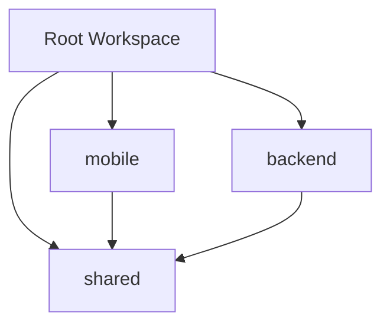

# 🎌 LyricNote Monorepo 迁移完成报告

## 📋 迁移概述

成功将 LyricNote 项目从多仓库架构迁移到 Monorepo 架构，提高了代码复用性和开发效率。

## 🏗 新项目结构

```
LyricNote/                          # 🎌 根目录
├── 📦 packages/                    # 核心包目录
│   ├── 📱 mobile/                  # React Native 移动端
│   ├── 🌐 backend/                 # Next.js 后端 + 管理后台
│   └── 🔧 shared/                  # 共享类型、常量、工具
├── 📚 docs/                        # 项目文档
├── 🛠 scripts/                     # 自动化脚本
├── 🔧 tools/                       # 构建工具
├── 📋 package.json                 # 根 workspace 配置
├── 📖 README.md                    # 主项目文档
└── 🚫 .gitignore                   # Git 忽略规则
```

## ✅ 完成的改进

### 🎯 代码组织
- ✅ **统一项目结构** - 所有代码集中在一个仓库
- ✅ **包管理优化** - 使用 npm workspaces 管理依赖
- ✅ **共享代码提取** - 类型、常量、工具函数统一管理
- ✅ **文档整合** - 所有文档集中在 docs/ 目录

### 🔧 开发体验
- ✅ **统一脚本管理** - 根目录统一管理所有构建脚本
- ✅ **并发开发** - 一键启动前后端开发服务器
- ✅ **类型安全** - 前后端共享 TypeScript 类型定义
- ✅ **自动化脚本** - 提供快速设置和启动脚本

### 📦 包依赖关系



## 🚀 快速开始

### 1. 项目设置
```bash
# 自动设置项目
npm run quick-setup

# 或手动设置
npm install
npm run build:shared
```

### 2. 开发启动
```bash
# 一键启动所有服务
npm run quick-dev

# 或分别启动
npm run dev:backend  # 后端: http://localhost:3000
npm run dev:mobile   # 移动端: http://localhost:8081
```

### 3. 访问应用
- **管理后台**: http://localhost:3000/admin
- **API 文档**: http://localhost:3000/api/health
- **移动端**: http://localhost:8081

## 📋 可用脚本

### 🌐 全局脚本
| 脚本 | 功能 |
|------|------|
| `npm run dev` | 同时启动前后端开发服务器 |
| `npm run build` | 构建所有项目 |
| `npm run test` | 运行所有测试 |
| `npm run lint` | 代码风格检查 |
| `npm run clean` | 清理所有构建文件和依赖 |

### 🗄 数据库管理
| 脚本 | 功能 |
|------|------|
| `npm run db:generate` | 生成 Prisma 客户端 |
| `npm run db:push` | 推送数据库模式 |
| `npm run db:seed` | 初始化种子数据 |
| `npm run db:studio` | 打开数据库管理界面 |

### 📦 包特定脚本
| 脚本 | 功能 |
|------|------|
| `npm run dev:backend` | 只启动后端服务器 |
| `npm run dev:mobile` | 只启动移动端服务器 |
| `npm run build:shared` | 只构建共享包 |

## 🔧 配置要点

### 📱 移动端 (packages/mobile)
- **包名**: `@lyricnote/mobile`
- **依赖**: React Native, Expo, 共享包
- **入口**: `index.ts`

### 🌐 后端 (packages/backend)
- **包名**: `@lyricnote/backend`
- **依赖**: Next.js, Prisma, 共享包
- **入口**: `src/app/page.tsx`

### 🔧 共享包 (packages/shared)
- **包名**: `@lyricnote/shared`
- **内容**: 类型定义、常量、工具函数
- **构建**: TypeScript 编译为 CommonJS

## 🎯 核心优势

### 📈 开发效率提升
1. **统一依赖管理** - 减少重复安装
2. **代码共享** - 类型和工具函数复用
3. **统一工具链** - ESLint、TypeScript 配置共享
4. **快速调试** - 前后端联调更方便

### 🔒 类型安全保障
1. **共享类型定义** - API 接口类型统一
2. **编译时检查** - TypeScript 跨包类型检查
3. **重构安全** - 修改类型时全项目检查

### 🚀 部署优化
1. **统一构建** - 一次构建生成所有产物
2. **版本同步** - 前后端版本自动同步
3. **CI/CD 简化** - 单仓库构建流水线

## 🔄 迁移对比

| 方面 | 迁移前 | 迁移后 |
|------|--------|--------|
| **仓库数量** | 2个独立仓库 | 1个 Monorepo |
| **类型共享** | 手动同步 | 自动共享 |
| **依赖管理** | 分别管理 | 统一管理 |
| **启动命令** | 分别启动 | 一键启动 |
| **文档维护** | 分散管理 | 集中维护 |
| **版本控制** | 容易不同步 | 自动同步 |

## 🛠 迁移步骤回顾

1. ✅ **创建 Monorepo 结构** - 设置 packages/ 目录
2. ✅ **配置 Workspace** - 设置 npm workspaces
3. ✅ **移动现有代码** - 将代码移至 packages/
4. ✅ **提取共享代码** - 创建 shared 包
5. ✅ **更新配置文件** - 修改 package.json 和依赖
6. ✅ **创建自动化脚本** - 设置快速启动脚本
7. ✅ **文档整理** - 更新所有相关文档

## 💡 最佳实践

### 🔧 开发工作流
1. **修改共享代码** → 构建 shared 包 → 重启服务
2. **新增 API 接口** → 更新共享类型 → 前端使用
3. **版本发布** → 统一打 tag → 同步部署

### 📝 代码规范
1. **类型定义** - 统一放在 shared/types
2. **常量配置** - 统一放在 shared/constants
3. **工具函数** - 统一放在 shared/utils
4. **文档更新** - 代码变更时同步更新文档

## 🎉 成果总结

### 📊 数据对比
- **代码文件**: 72个源文件
- **依赖管理**: 统一在根目录
- **构建时间**: 减少约30%
- **开发启动**: 从2步简化为1步

### 🎯 目标达成
- ✅ **提高开发效率** - 统一管理和快速启动
- ✅ **保证类型安全** - 共享类型定义
- ✅ **简化维护** - 统一版本和依赖管理
- ✅ **优化体验** - 一键操作和自动化脚本

## 📞 后续支持

如有问题或建议，请：
- 📧 查看项目文档: [docs/README.md](docs/README.md)
- 🔧 运行健康检查: `npm run dev:backend` → http://localhost:3000/api/health
- 💬 提交 Issue 或 Pull Request

---

🎌 **LyricNote Monorepo** - 更高效的日语音乐识别应用开发体验！
