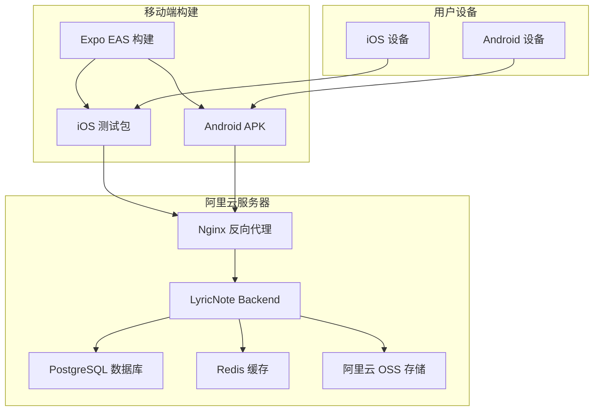

# 🚀 LyricNote 完整部署指南

## 📋 部署概述

本指南将帮助您在阿里云服务器上使用 Docker 部署 LyricNote 项目，并生成 iOS 和 Android 测试包。

## 🏗 架构概览



## 🔧 服务器环境准备

### 1. 系统要求
- **操作系统**: Ubuntu 20.04+ / CentOS 8+
- **内存**: 至少 2GB RAM（推荐 4GB+）
- **存储**: 至少 20GB 可用空间
- **网络**: 公网 IP 和域名

### 2. 安装 Docker 和 Docker Compose

```bash
# 安装 Docker
curl -fsSL https://get.docker.com -o get-docker.sh
sh get-docker.sh

# 启动 Docker 服务
sudo systemctl start docker
sudo systemctl enable docker

# 安装 Docker Compose
sudo curl -L "https://github.com/docker/compose/releases/download/v2.20.0/docker-compose-$(uname -s)-$(uname -m)" -o /usr/local/bin/docker-compose
sudo chmod +x /usr/local/bin/docker-compose

# 验证安装
docker --version
docker-compose --version
```

### 3. 配置防火墙

```bash
# 开放必要端口
sudo ufw allow 22      # SSH
sudo ufw allow 80      # HTTP
sudo ufw allow 443     # HTTPS
sudo ufw enable
```

## 📦 项目部署

### 1. 克隆项目到服务器

```bash
# 在服务器上克隆项目
cd /opt
sudo git clone https://github.com/your-username/lyricnote.git
cd lyricnote

# 设置权限
sudo chown -R $USER:$USER /opt/lyricnote
```

### 2. 配置环境变量

```bash
# 复制环境配置模板
cp env.production.example .env

# 编辑环境配置
nano .env
```

**重要配置项**：
```bash
# 数据库配置
POSTGRES_PASSWORD=your_secure_password_here
REDIS_PASSWORD=your_redis_password_here

# JWT 密钥（至少32字符）
JWT_SECRET=your_jwt_secret_key_minimum_32_characters
NEXTAUTH_SECRET=your_nextauth_secret_minimum_32_characters

# AI 服务
DEEPSEEK_API_KEY=your_deepseek_api_key

# 阿里云 OSS
ALIYUN_OSS_ACCESS_KEY_ID=your_access_key_id
ALIYUN_OSS_ACCESS_KEY_SECRET=your_access_key_secret
ALIYUN_OSS_BUCKET=your_bucket_name
ALIYUN_OSS_REGION=oss-cn-hangzhou

# 域名配置
DOMAIN=your-domain.com
```

### 3. 配置 SSL 证书

#### 选项 A: 使用 Let's Encrypt（推荐）

```bash
# 安装 Certbot
sudo apt-get update
sudo apt-get install certbot

# 获取 SSL 证书
sudo certbot certonly --standalone -d your-domain.com

# 复制证书到项目目录
sudo cp /etc/letsencrypt/live/your-domain.com/fullchain.pem nginx/ssl/cert.pem
sudo cp /etc/letsencrypt/live/your-domain.com/privkey.pem nginx/ssl/key.pem
sudo chown $USER:$USER nginx/ssl/*

# 设置自动续期
sudo crontab -e
# 添加以下行：
# 0 12 * * * /usr/bin/certbot renew --quiet
```

#### 选项 B: 使用自签名证书（仅测试）

```bash
# 生成自签名证书
openssl req -x509 -nodes -days 365 -newkey rsa:2048 \
    -keyout nginx/ssl/key.pem \
    -out nginx/ssl/cert.pem \
    -subj "/C=CN/ST=State/L=City/O=Organization/CN=your-domain.com"
```

### 4. 更新 Nginx 配置

```bash
# 编辑 Nginx 配置
nano nginx/nginx.conf

# 将 'your-domain.com' 替换为您的实际域名
sed -i 's/your-domain.com/你的域名.com/g' nginx/nginx.conf
```

### 5. 执行部署

```bash
# 运行部署脚本
./scripts/deploy.sh

# 或者手动执行步骤
npm install
npm run build:shared
docker-compose up -d
```

### 6. 验证部署

```bash
# 检查服务状态
docker-compose ps

# 查看日志
docker-compose logs -f

# 健康检查
curl https://your-domain.com/api/health
```

## 📱 移动端构建和测试

### 1. 安装 Expo 开发工具

```bash
# 安装 Expo CLI 和 EAS CLI
npm install -g @expo/cli eas-cli

# 创建 Expo 账户（如果没有）
# 访问 https://expo.dev 注册账户
```

### 2. 配置 Expo 项目

```bash
# 进入移动端目录
cd packages/mobile

# 登录 Expo
eas login

# 配置项目
expo install
```

**更新 `app.json` 配置**：
```json
{
  "expo": {
    "owner": "your-expo-username",
    "projectId": "your-expo-project-id",
    "extra": {
      "apiUrl": "https://your-domain.com/api"
    }
  }
}
```

### 3. 构建测试包

#### 方法 A: 使用构建脚本（推荐）

```bash
# 返回项目根目录
cd ../..

# 运行移动端构建脚本
./scripts/build-mobile.sh

# 选择构建类型：
# 1 - 开发版本（包含调试功能）
# 2 - 预览版本（内部测试）
# 3 - 生产版本（应用商店）
```

#### 方法 B: 手动构建

```bash
cd packages/mobile

# 构建开发版本
eas build --platform android --profile development  # Android APK
eas build --platform ios --profile development      # iOS 模拟器

# 构建预览版本（推荐用于测试）
eas build --platform android --profile preview      # Android APK
eas build --platform ios --profile preview          # iOS TestFlight

# 构建生产版本
eas build --platform all --profile production       # 双平台
```

### 4. 下载和安装测试包

#### Android 测试包安装

```bash
# 查看构建列表
eas build:list --limit=5

# 下载 APK 文件
# 可以直接从 Expo 网站下载，或使用命令：
eas build:download [BUILD_ID]

# 安装到 Android 设备：
# 1. 在设备上启用"未知来源"安装
# 2. 将 APK 传输到设备
# 3. 点击安装
```

#### iOS 测试包安装

```bash
# 方法 1: 使用 TestFlight（推荐）
eas submit --platform ios

# 方法 2: 使用 Expo Go 开发版本
eas build:run [BUILD_ID]

# 方法 3: 使用 iOS 模拟器
# 下载 .app 文件并拖拽到模拟器
```

## 🔧 管理和维护

### 日常运维命令

```bash
# 查看服务状态
docker-compose ps

# 查看日志
docker-compose logs -f [service_name]

# 重启服务
docker-compose restart [service_name]

# 更新代码
git pull
docker-compose build
docker-compose up -d

# 备份数据库
docker-compose exec postgres pg_dump -U lyricnote lyricnote > backup.sql

# 清理无用镜像
docker system prune -a
```

### 监控和调试

```bash
# 实时监控资源使用
docker stats

# 进入容器调试
docker-compose exec backend bash
docker-compose exec postgres psql -U lyricnote -d lyricnote

# 查看数据库
docker-compose exec backend npx prisma studio
# 访问 http://your-domain.com:5555
```

## 📊 性能优化

### 1. 数据库优化

```sql
-- 创建索引优化查询
CREATE INDEX idx_songs_title ON "Song"(title);
CREATE INDEX idx_lyrics_song_id ON "Lyric"("songId");
CREATE INDEX idx_recognition_user_id ON "Recognition"("userId");
```

### 2. Redis 缓存配置

```bash
# 在 .env 中配置 Redis 内存限制
REDIS_MAXMEMORY=256mb
REDIS_MAXMEMORY_POLICY=allkeys-lru
```

### 3. Nginx 优化

```nginx
# 在 nginx.conf 中添加缓存配置
location ~* \.(js|css|png|jpg|jpeg|gif|ico|svg)$ {
    expires 1y;
    add_header Cache-Control "public, immutable";
}
```

## 🚨 故障排除

### 常见问题和解决方案

#### 1. 数据库连接失败
```bash
# 检查数据库状态
docker-compose logs postgres

# 重置数据库
docker-compose down
docker volume rm lyricnote_postgres_data
docker-compose up -d postgres
```

#### 2. 移动端构建失败
```bash
# 清理缓存
cd packages/mobile
rm -rf node_modules .expo
npm install

# 检查 Expo 配置
expo doctor
```

#### 3. SSL 证书问题
```bash
# 检查证书状态
openssl x509 -in nginx/ssl/cert.pem -text -noout

# 重新获取证书
sudo certbot renew --force-renewal
```

#### 4. 内存不足
```bash
# 增加交换空间
sudo fallocate -l 2G /swapfile
sudo chmod 600 /swapfile
sudo mkswap /swapfile
sudo swapon /swapfile
echo '/swapfile none swap sw 0 0' | sudo tee -a /etc/fstab
```

## 📱 移动端分发

### TestFlight（iOS）
1. 在 App Store Connect 创建应用
2. 配置 TestFlight
3. 上传构建版本：`eas submit --platform ios`
4. 邀请测试用户

### Google Play Console（Android）
1. 在 Google Play Console 创建应用
2. 上传 AAB 文件：`eas submit --platform android`
3. 创建内测轨道
4. 分享测试链接

### 内部分发
1. 生成预览版本：`eas build --profile preview`
2. 分享下载链接
3. 使用 Expo Go 扫码安装

## 🔐 安全建议

### 1. 服务器安全
- 定期更新系统和 Docker
- 使用强密码和 SSH 密钥
- 配置防火墙规则
- 启用自动安全更新

### 2. 应用安全
- 定期轮换密钥
- 监控异常访问
- 实施 API 速率限制
- 加密敏感数据

### 3. 备份策略
```bash
# 数据库定期备份
#!/bin/bash
docker-compose exec postgres pg_dump -U lyricnote lyricnote | gzip > "backup_$(date +%Y%m%d_%H%M%S).sql.gz"

# 上传到阿里云 OSS（可选）
ossutil cp backup_*.sql.gz oss://your-backup-bucket/
```

## 📞 支持和联系

- **技术支持**: 查看项目 Issues
- **文档**: [项目文档](../README.md)
- **更新**: `git pull && ./scripts/deploy.sh`

---

🎌 **LyricNote 部署完成！** 您的日语音乐识别应用已经可以在生产环境中使用了！
